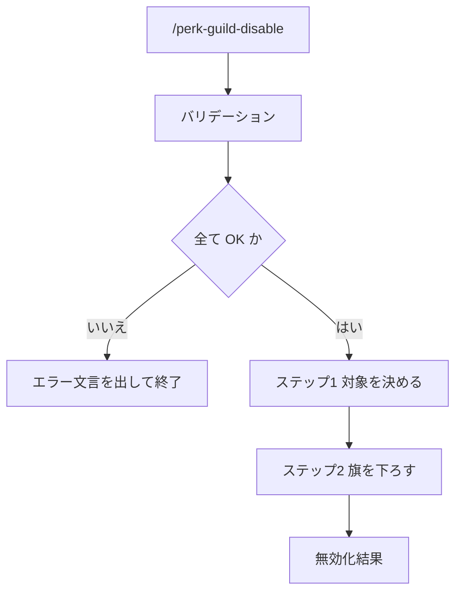

# Perk / Guild 無効化

## Help情報

指定した作業ファイル（または文脈上の現行ファイル）の overlay を下ろす。
他ファイルに残った旗は維持する。

* 対象ファイルの `perk.guild` を `disabled` にする
* Session 用の旗があれば同様に下ろす
* 無効化後は、そのファイルでは `workspace-agent-perk-guild` のゲートを掛けない

### Example

```text
/perk-guild-disable
```

```text
/perk-guild-disable .ai-agent/plan/login-home.md
```

## 関連ファイル

* `workspace-agent-perk-guild`
* `/perk-guild-enable`

## 入力

### Optional: 作業ファイル

* 引数のパス、または文脈上の現行作業ファイルから確定する
* 未指定かつ文脈にも無い場合は、Session の旗だけを下ろして終了してよい
* パスが指定されているが存在しない・複数候補で特定不能な場合はエラー終了する

#### 作業ファイル: 入力値の例

* `.ai-agent/plan/login-home.md`
* （省略）→ Session のみ

## 出力

### Required: 無効化結果

* 下ろしたファイルのパス、または Session のみであること

#### 無効化結果: 出力値の例

```text
perk.guild: disabled
file: .ai-agent/plan/login-home.md
```

## 手順



### バリデーション

入力:

| Label | 値 | バリデーション |
| --- | --- | --- |
| 作業ファイル | {パス、または空} | ✅️ |

* 作業ファイルが指定されているが、存在しないまたは特定不能 → `作業ファイル` を ⛔️
* 1つでも ⛔️ なら対話せず終了する

```markdown
{XXXX} が不明確です。
コマンドを終了します。
```

### ステップ1: 対象を決める

* 指定または文脈のファイルがあればそれを対象にする
* 無ければ Session の旗だけを対象にする
* 他のミッションファイルは対象にしない

### ステップ2: 旗を下ろす

* 対象ファイルがあるなら、先頭 YAML の `perk.guild` を `disabled` にする。他の欄は残す
* `folder:this/.ai-agent/perk-guild.yaml` があれば `perk.guild: disabled` にする
* プロダクションコードと作業本文は変えない

## ガードレール

* ユーザーと対話しない
* 入力が不明確な場合はエラー終了する

```markdown
{XXXX} が不明確です。
コマンドを終了します。
```

* 他ミッションの旗を一括で下ろさない
* 作業本文と `phase` / `current` / `evidence` を消さない

## ナレッジベース

### DO: 無効化は対象ファイルと Session に限る

* 駐車した他ミッションは、旗を残したまま再開できる

### DO NOT: disabled のときに作業本文を消す

* 理由: 無効化は overlay を切るだけである
