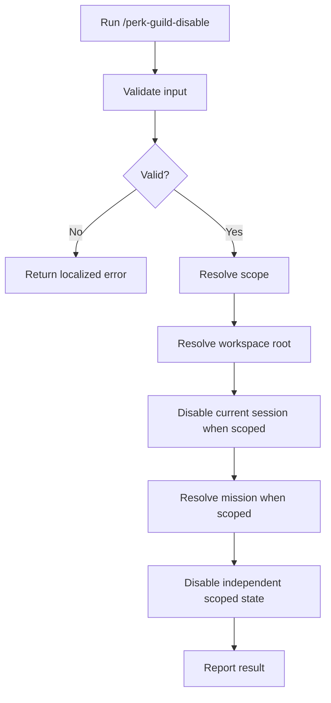

# Disable Perk / Guild

## Help

Disable the overlay for the current conversation session, a selected mission,
or both. Preserve every unrelated session and mission.

* Support independent `session`, `mission`, and `both` scopes.
* Default to `both`.
* Remove only the current session's record for session scope.
* Set only the selected mission's `perk.guild` to `disabled` for mission
  scope.
* Localize user-facing output to the user's language and locale. Keep paths,
  command names, YAML keys, and enum values unchanged.
* Every assistant-authored prose message, including errors, begins with the
  localized Submaster label. For an undocumented locale, use `[Submaster]`.

`perk.guild` is a nested YAML field path, not a literal key:

```yaml
perk:
  guild: disabled
```

### Examples

```text
/perk-guild-disable
```

```text
/perk-guild-disable .ai-agent/plan/login-home.md
```

```text
/perk-guild-disable --scope session
```

```text
/perk-guild-disable --scope mission .ai-agent/plan/login-home.md
```

## Related

* `workspace-agent-perk-guild`
* `/perk-guild-enable`

## Input

### Optional: Scope

Accepted values:

```text
session | mission | both
```

Default: `both`.

* `session` changes only the current conversation session.
* `mission` changes only the selected mission work file.
* `both` applies both changes independently.

### Optional: Work file

Resolve it from an explicit path or the current work-file context.

* When scope includes `mission`, an omitted and unresolved work file means
  there is no mission target; disable the session scope when applicable and
  report that no mission was changed.
* With `session` scope, a work file is ignored.
* If an explicit path does not exist or resolves to multiple candidates,
  return an error without asking a follow-up question.

Examples:

* `.ai-agent/plan/login-home.md`
* omitted, meaning session only when no contextual file exists

## Output

Start the user-facing result with the localized Submaster label (`[Submaster]`
or `[サブマスター]`). This command is a Submaster operation.

Report the applied scope, session-record path when session disablement was
persisted, mission path when changed, separate `session`, `mission`, and
`effective` states, and independent `session_persisted` and
`mission_persisted` booleans.

Canonical output shape when only session scope is disabled and the mission
remains enabled:

```text
[Submaster]
scope: session
session: disabled
mission: enabled
effective: enabled
session_persisted: true
mission_persisted: false
session_record: .ai-agent/perk-guild/sessions/{session-key}.yaml
file: .ai-agent/plan/login-home.md
```

Localize any explanatory prose, but do not translate these machine-readable
fields.

## Procedure



### Validation

| Input | Valid when |
| --- | --- |
| Scope | `session`, `mission`, `both`, or omitted |
| Work file | Empty, or resolves to exactly one file |
| Workspace root | Resolves to exactly one workspace root |

Error responses begin with the localized Submaster label.

Canonical localized error response:

```text
[Submaster]
{input name} is ambiguous.
Command aborted.
```

Do not ask the user to select or clarify within this command.

### Step 1: Resolve the workspace root

Canonicalize every open workspace root with `realpath`. Canonicalize an
existing explicit, contextual, or routed mission path with `realpath` and
accept it only when it is inside exactly one open workspace root. Without a
mission path, use the only open workspace root.

If resolution does not select exactly one open workspace root, return a
localized Submaster error before writing. Reject traversal and boundary-prefix
lookalikes. Do not infer a root from an unrelated Git repository, sibling
directory, or process working directory.

Before session-state access, inspect every path component from
`<workspace-root>/.ai-agent/perk-guild` through `sessions` without following
links. Reject a symlinked state directory or any symlink component in that
range.

Write mission YAML atomically using a temporary file in the same directory,
then rename or replace it over the destination. Never truncate in place.

### Step 2: Resolve and disable session scope

When scope includes `session`:

1. Obtain the host's stable conversation identifier.
2. Encode the identifier as UTF-8 and compute its SHA-256 digest. Use the full
   64-character lowercase hexadecimal digest as `session-key`. Never persist
   the raw identifier.
3. Resolve every scoped target and complete all validation before deleting or
   writing anything.
4. If the record exists, delete only that record. An absent record means
   session scope is disabled:

   ```text
   <workspace-root>/.ai-agent/perk-guild/sessions/<session-key>.yaml
   ```

5. If a stable identifier exists, report `session_persisted: true` after the
   record is absent. If no stable identifier is available, disable only
   in-memory state for the current conversation and report
   `session_persisted: false`. That state is lost
   after context compression, closing the conversation, or restarting the
   host. Do not inspect or alter another session and do not use a
   workspace-global fallback.

### Step 3: Resolve the mission target

When scope includes `mission`:

* Resolve the mission in this order:
  explicit mission path > current work-file context > `current_mission`.
* If neither exists, leave all missions unchanged and report that no mission
  target was resolved.
* Do not inspect or alter other mission files.

When scope is `session`, do not resolve or modify a mission.

### Step 4: Disable mission scope

* When mission scope has a target file, set only its `perk.guild` field to
  `disabled`.
  Preserve its body and all other status fields.
* Report `mission_persisted: true` only after the atomic mission write
  succeeds. If no mission was written, report `mission_persisted: false`.
* A mission-only disable leaves `current_mission` unchanged. A later ordinary
  session rehydration clears it when the routed mission is missing, outside the
  workspace root, disabled, `done`, or `skip`.
* Do not modify production code.

### Step 5: Report effective state

Report `session`, `mission`, `effective`, `session_persisted`, and
`mission_persisted` separately.
`effective` is disabled only when neither the current session nor selected
mission is enabled. Speak as Submaster for this message only; prefix the
response with the localized Submaster label. Do not persist or overwrite
`active_role` in a deleted session record or in a disabled mission's
frontmatter. Do not switch roles midway.

## Guardrails

* Keep the command non-interactive.
* Return a localized error and stop when explicit input is ambiguous.
* Never bulk-disable other missions.
* Never disable another conversation's session record.
* Never automatically expire enabled session records; they support reopening
  the same conversation.
* Do not change mission state in `session` scope.
* Do not write session state in `mission` scope, including `active_role` and
  `current_mission`.
* Never create or update a workspace-global session flag.
* Moving from 0.1.x to 0.2.0 is a breaking migration, not an automatic
  migration. `.ai-agent/perk-guild.yaml` is ignored and left untouched.
  Instruct upgraded users to run `/perk-guild-enable --scope session`,
  `/perk-guild-enable --scope mission`, or
  `/perk-guild-enable --scope both`, verify the new state, and delete the
  legacy file when satisfied.
* Do not delete the work-file body, `phase`, `current`, `evidence`, or brief.
* Disabling one scope does not remove the overlay while the other scope
  remains enabled.
