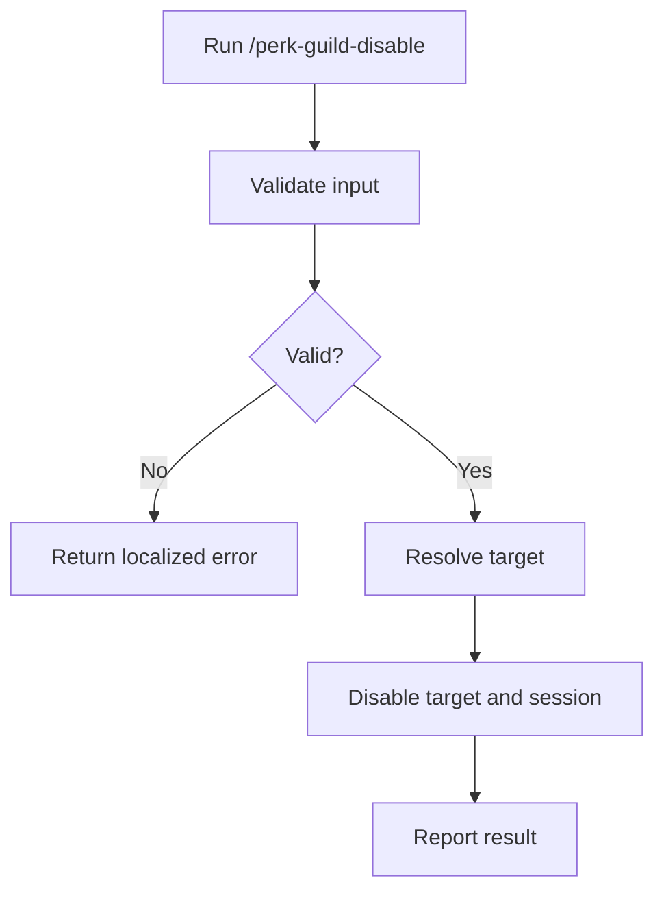

# Disable Perk / Guild

## Help

Disable the overlay for an explicit work file or the current contextual work
file. Preserve flags on every other mission.

* Set the target file's `perk.guild` to `disabled`.
* Disable the session flag when it exists.
* Stop applying `workspace-agent-perk-guild` gates to that file.
* Localize user-facing output to the user's language and locale. Keep paths,
  command names, YAML keys, and enum values unchanged.

### Examples

```text
/perk-guild-disable
```

```text
/perk-guild-disable .ai-agent/plan/login-home.md
```

## Related

* `workspace-agent-perk-guild`
* `/perk-guild-enable`

## Input

### Optional: Work file

Resolve it from an explicit path or the current work-file context.

* If neither exists, disable only the session flag and finish.
* If an explicit path does not exist or resolves to multiple candidates,
  return an error without asking a follow-up question.

Examples:

* `.ai-agent/plan/login-home.md`
* omitted, meaning session only when no contextual file exists

## Output

Report either the disabled file path or that only the session was disabled.

Canonical output shape:

```text
perk.guild: disabled
file: .ai-agent/plan/login-home.md
```

Localize any explanatory prose, but do not translate these machine-readable
fields.

## Procedure



### Validation

| Input | Valid when |
| --- | --- |
| Work file | Empty, or resolves to exactly one file |

If validation fails, return a localized equivalent of the following and stop:

```text
{input name} is ambiguous.
Command aborted.
```

Do not ask the user to select or clarify within this command.

### Step 1: Resolve the target

* Use an explicit or contextual work file when available.
* Otherwise, target only the session flag.
* Do not inspect or alter other mission files.

### Step 2: Disable

* When a target file exists, set only its `perk.guild` field to `disabled`.
  Preserve its body and all other status fields.
* If `folder:this/.ai-agent/perk-guild.yaml` exists, set its `perk.guild`
  field to `disabled`.
* Do not modify production code.

## Guardrails

* Keep the command non-interactive.
* Return a localized error and stop when explicit input is ambiguous.
* Never bulk-disable other missions.
* Do not delete the work-file body, `phase`, `current`, `evidence`, or brief.
* Disabling removes the overlay; it does not erase the mission.
