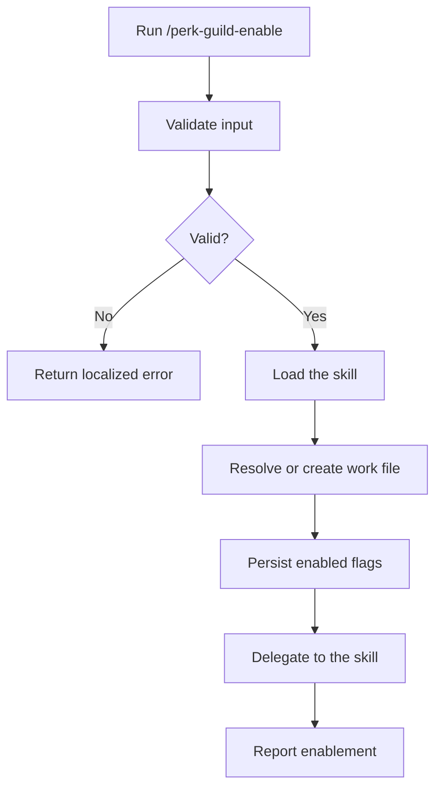

# Enable Perk / Guild

## Help

Enable the overlay that owns the durable mission record, brief, phase
doctrine, transition gates, and build-nothing outcome. Do not replace any
implementation-quality procedure.

* Persist enablement in both the session and the work file.
* Accept an optional goal or follow-up task after the command.
* After writing the flag, follow `workspace-agent-perk-guild`.
* With no goal or follow-up task, delegate to the skill's standalone entry.
* Localize user-facing output according to the skill's language and locale
  rules. Keep command names, paths, YAML keys, and enum values unchanged.

### Examples

```text
/perk-guild-enable
```

```text
/perk-guild-enable .ai-agent/plan/login-home.md
```

```text
/perk-guild-enable Reduce confusion after sign-in. Do not add a new screen.
```

## Related

* `workspace-agent-perk-guild`
* `/perk-guild-disable`

## Input

### Optional: Work file

Resolve it from an explicit path or the current work-file context.

* If neither exists, continue without a path and create a work file in step 2.
* If an explicit path does not exist or resolves to multiple candidates,
  return an error without asking a follow-up question.

Examples:

* `.ai-agent/plan/login-home.md`
* `login-home`

### Optional: Goal

Treat the remaining text as the pain to address, the boundary against
overbuilding, or a follow-up task.

If absent, leave it empty and delegate to the skill's standalone entry after
enabling.

## Output

Report:

* the flagged work-file path;
* that the session is enabled;
* that mission handling continues under `workspace-agent-perk-guild`.

Canonical output shape:

```text
perk.guild: enabled
file: .ai-agent/plan/login-home.md
Continue with workspace-agent-perk-guild.
```

Translate the explanatory sentence to the user's language. Do not translate
the first two machine-readable lines.

## Procedure



### Validation

| Input | Valid when |
| --- | --- |
| Work file | Empty, or resolves to exactly one file |
| Goal | Any text or empty |

If validation fails, return a localized equivalent of the following and stop:

```text
{input name} is ambiguous.
Command aborted.
```

Do not ask the user to select or clarify within this command.

### Step 1: Load the skill

* Load `workspace-agent-perk-guild`.
* Begin its behavior with rehydration.

### Step 2: Resolve the work file

* Use the explicit or contextual work file when available.
* Otherwise, create a mission work file in the workspace's existing
  work-planning location.
  * Derive a short kebab-case name from the goal or current timestamp.
  * The body may begin with a minimal heading. Frontmatter is the source of
    truth.

### Step 3: Persist the flags

Update work-file frontmatter idempotently:

* set `perk.guild` to `enabled`;
* set a missing `phase` to `research`;
* fill empty brief fields from the goal when possible;
* update `updated_at`.

Also write the session flag idempotently to
`folder:this/.ai-agent/perk-guild.yaml`:

```yaml
perk:
  guild: enabled
```

### Step 4: Delegate

* With a goal or follow-up task, proceed under the skill's instructed path.
* Without either, delegate to the skill's standalone entry. The command does
  not ask the question itself.

## Guardrails

* This command writes flags. The skill owns mission selection.
* Do not guess when an explicit work file is missing or ambiguous.
* Preserve the existing work-file body and unknown frontmatter fields.
* Do not rewrite implementation-quality procedures.
* Do not modify production code merely by enabling the overlay.
* Keep all user-facing prose localized to the user's environment.
