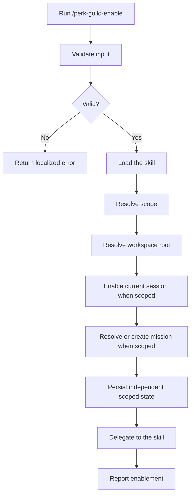

# Enable Perk / Guild

## Help

Enable the overlay that owns the durable mission record, brief, phase
doctrine, transition gates, and build-nothing outcome. Do not replace any
implementation-quality procedure.

* Support independent `session`, `mission`, and `both` scopes.
* Default to `both`.
* Accept an optional goal or follow-up task after the command.
* After writing the flag, follow `workspace-agent-perk-guild`.
* With no goal or follow-up task, delegate to the skill's standalone entry.
* Localize user-facing output according to the skill's language and locale
  rules. Keep command names, paths, YAML keys, and enum values unchanged.
* Every assistant-authored prose message, including errors, begins with the
  localized Submaster label. For an undocumented locale, use `[Submaster]`.

`perk.guild` is a nested YAML field path, not a literal key:

```yaml
perk:
  guild: enabled
```

### Examples

```text
/perk-guild-enable
```

```text
/perk-guild-enable .ai-agent/plan/login-home.md
```

```text
/perk-guild-enable --scope session
```

```text
/perk-guild-enable --scope mission .ai-agent/plan/login-home.md
```

```text
/perk-guild-enable Reduce confusion after sign-in. Do not add a new screen.
```

## Related

* `workspace-agent-perk-guild`
* `/perk-guild-disable`

## Input

### Optional: Scope

Accepted values:

```text
session | mission | both
```

Default: `both`.

* `session` changes only the current conversation session.
* `mission` changes only the selected mission work file.
* `both` applies both changes independently.

### Optional: Work file

Resolve it according to the authoritative table below. With `session` scope,
ignore mission input and never read, create, or modify mission state.

Examples:

* `.ai-agent/plan/login-home.md`
* `login-home`

### Optional: Goal

Treat the remaining text as the pain to address, the boundary against
overbuilding, or a follow-up task.

If absent, leave it empty and delegate to the skill's standalone entry after
enabling.

### Authoritative mission creation decision table

This is the authoritative mission-target decision table. Summaries elsewhere
must not add fallback behavior.

| Scope and inputs | Result |
| --- | --- |
| `session` | Never create or modify mission state. |
| `mission` or `both` with an explicit existing path | Use that path. |
| `mission` or `both` with an explicit missing path | Return an error. |
| No explicit path and a contextual mission | Use the contextual mission. |
| No mission and a non-empty goal | Create deterministically under `<workspace-root>/.ai-agent/plan/`; reuse the same derived name. |
| `both`, no mission, and no goal | Enable session scope and report mission skipped. |
| `mission`, no mission, and no goal | Return an error. |

## Output

Start the user-facing result with the localized Submaster label (`[Submaster]`
or `[サブマスター]`). This command is a Submaster operation.

Report:

* the applied scope;
* the session-record path when one was persisted;
* the flagged work-file path when mission scope was applied;
* the separate `session`, `mission`, and `effective` states;
* independent `session_persisted` and `mission_persisted` booleans;
* that mission handling continues under `workspace-agent-perk-guild`.

Canonical output shape:

```text
[Submaster]
scope: both
session: enabled
mission: enabled
effective: enabled
session_persisted: true
mission_persisted: true
session_record: .ai-agent/perk-guild/sessions/{session-key}.yaml
file: .ai-agent/plan/login-home.md
Continue with workspace-agent-perk-guild.
```

Translate the explanatory sentence to the user's language. Do not translate
the machine-readable lines.

## Procedure



### Validation

| Input | Valid when |
| --- | --- |
| Scope | `session`, `mission`, `both`, or omitted |
| Work file | Empty, or resolves to exactly one file |
| Goal | Any text or empty |
| Workspace root | Resolves to exactly one workspace root |

Error responses begin with the localized Submaster label.

Canonical localized error response:

```text
[Submaster]
{input name} is ambiguous.
Command aborted.
```

Do not ask the user to select or clarify within this command.

### Step 1: Load the skill

* Load `workspace-agent-perk-guild`.
* Begin its behavior with rehydration.

### Step 2: Resolve the workspace root

Canonicalize every open workspace root with `realpath`.

* For an existing explicit or contextual mission, canonicalize the mission
  path with `realpath` and accept it only when it is inside exactly one open
  workspace root.
* For a new mission, canonicalize its nearest existing parent with `realpath`,
  append the not-yet-created components without resolving links, and verify
  that the eventual path remains inside exactly one open workspace root.
* Without mission input, use the only open workspace root.

Reject traversal and boundary-prefix lookalikes. If the result is not exactly
one open workspace root, return a localized Submaster error before writing. Do
not infer a root from an unrelated Git repository, sibling directory, or
process working directory.

Before session-state access, inspect every path component from
`<workspace-root>/.ai-agent/perk-guild` through `sessions` without following
links. Reject a symlinked state directory or any symlink component in that
range.

Write every YAML file atomically using a temporary file in the same directory,
then rename or replace it over the destination. Never truncate in place.

### Step 3: Resolve and persist session scope

When scope includes `session`:

1. Obtain the host's stable conversation identifier.
2. Encode the identifier as UTF-8 and compute its SHA-256 digest. Use the full
   64-character lowercase hexadecimal digest as `session-key`. Hash every
   identifier and never persist the raw identifier.
3. Before writing any session record, atomically create or verify this VCS
   exclusion file:

   ```text
   <workspace-root>/.ai-agent/perk-guild/sessions/.gitignore
   ```

   with exactly these rules, preserving an already-correct file:

   ```gitignore
   *
   !.gitignore
   ```

4. Write the session record idempotently to:

   ```text
   <workspace-root>/.ai-agent/perk-guild/sessions/<session-key>.yaml
   ```

   ```yaml
   perk:
     guild: enabled
   active_role: submaster
   session_key: "<sha256-lowercase-hex>"
   session_alias: "<uuid-v4>"
   current_mission: ""
   updated_at: ""
   ```

5. For a new record, create a random UUIDv4 `session_alias`. For an existing
   record, reuse its `session_alias`; never rotate it during an update.
6. In `session` scope, preserve an existing `current_mission` and use an empty
   value only for a new record. In `both` scope, update `current_mission` after
   the mission target is safely resolved.
7. If no stable identifier is available, keep enablement and
   `active_role: submaster` only in the current conversation context and
   report `session_persisted: false`. This in-memory Submaster initialization is
   lost after context compression, closing the conversation, or restarting the
   host. Do not use a workspace-global fallback.

### Step 4: Resolve the work file

When scope includes `mission`:

* Follow the authoritative mission creation decision table without fallback.
* Derive goal-based filenames as deterministic short kebab-case. The same goal
  must derive the same name, and an existing file with that name is reused.
* Never create a timestamp-named mission.
* A new work-file body may begin with a minimal heading. Frontmatter is the
  source of truth.

When scope is `session`, do not create or modify a mission file.

### Step 5: Persist mission scope

When scope includes `mission`, update work-file frontmatter idempotently:

* set the nested YAML field path `perk.guild` to `enabled`;
* set `active_role` to `submaster`;
* set a missing `phase` to `research`;
* ensure `chat_sessions` starts as `[]` when absent;
* fill empty brief fields from the goal when possible;
* update `updated_at`.
* upsert a `chat_sessions` entry only when the current session record was
  persisted, using only its reused `session_alias`, `kind`, and a short `note`.
  Update an existing entry with the same `session_alias`; never duplicate.
  Never write `session_key` or a raw host identifier into mission state.

Example mission frontmatter after enablement:

```yaml
perk:
  guild: enabled
active_role: submaster
phase: research
current: ""
chat_sessions: []
updated_at: ""
```

When both scopes apply, set the session record's `current_mission` to the
selected work-file path as a normalized, workspace-relative POSIX path. A
mission-only enable must not write the session's `active_role` or
`current_mission`.

### Step 6: Report effective state and delegate

* With a goal or follow-up task, proceed under the skill's instructed path.
  Before handing off, write the next `active_role` when the pending action
  requires a role other than Submaster.
* Without either, delegate to the skill's standalone entry as Submaster. The
  command does not ask the question itself.
* Compute `effective` as enabled when either scoped state is enabled.
* Report `session_persisted` and `mission_persisted` independently. In-memory
  session state means `session_persisted: false`; a successfully written
  mission means `mission_persisted: true`.

## Guardrails

* This command writes flags. The skill owns mission selection.
* An explicit missing or ambiguous mission path is an error whenever mission
  scope is active. Do not fall back to context or goal creation.
* Preserve the existing work-file body and unknown frontmatter fields.
* Do not change mission state in `session` scope.
* Do not change session state in `mission` scope.
* Never create a workspace-global session flag.
* Moving from 0.1.x to 0.2.0 is a breaking migration, not an automatic
  migration. `.ai-agent/perk-guild.yaml` is ignored and left untouched.
  Instruct upgraded users to run `/perk-guild-enable --scope session`,
  `/perk-guild-enable --scope mission`, or
  `/perk-guild-enable --scope both`, verify the new state, and delete the
  legacy file when satisfied.
* Do not rewrite implementation-quality procedures.
* Do not modify production code merely by enabling the overlay.
* Keep all user-facing prose localized to the user's environment.
