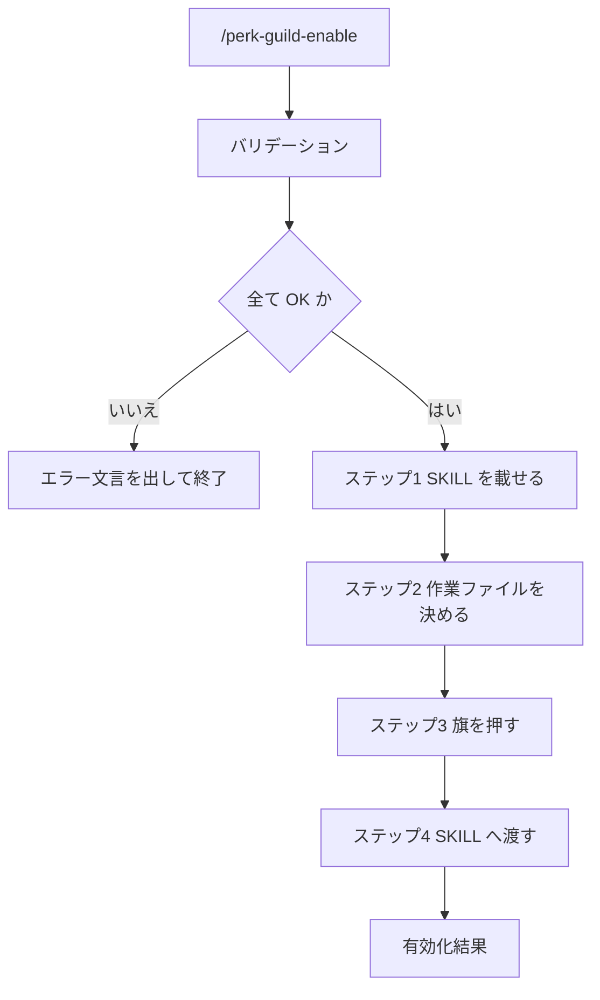

# Perk / Guild 有効化

## Help情報

状況の正本、brief、局面の教義、遷移ゲート、作らない完了を載せる overlay を有効化する。
実装品質の手続きは置き換えない。

* 有効化は Session と、作業ファイル先頭の `perk.guild: enabled` の両方に残す
* 続けて目標や後続作業を書いてよい
* 旗を立てたあと、`workspace-agent-perk-guild` に従う
* 目標も後続も無いときは、同 SKILL の単発入口（一覧して聞く）へ渡す

### Example

```text
/perk-guild-enable
```

```text
/perk-guild-enable .ai-agent/plan/login-home.md
```

```text
/perk-guild-enable ログイン後の遷移で迷う痛みを直したい。新画面は増やさない
```

## 関連ファイル

* `workspace-agent-perk-guild`
* `/perk-guild-disable`

## 入力

### Optional: 作業ファイル

* 引数のパス、または文脈上の現行作業ファイルから確定する
* 未指定かつ文脈にも無い場合は、空として続行してよい（ステップ2で起こす）
* パスが指定されているが存在しない・複数候補で特定不能な場合はエラー終了する

#### 作業ファイル: 入力値の例

* `.ai-agent/plan/login-home.md`
* `login-home`

### Optional: 目標

* 引数の残りの文。誰の何の痛みか、やりすぎない範囲、後続作業
* 未指定なら空。有効化後は SKILL の単発入口へ渡す

#### 目標: 入力値の例

* `誰の何の痛みかを直したい。やりすぎない範囲: 新画面を増やさない`
* （省略）

## 出力

### Required: 有効化結果

* 旗を押した作業ファイルのパス
* Session が有効であること
* このあと `workspace-agent-perk-guild` に従うこと

#### 有効化結果: 出力値の例

```text
perk.guild: enabled
file: .ai-agent/plan/login-home.md
このあと workspace-agent-perk-guild に従う
```

## 手順



### バリデーション

入力:

| Label | 値 | バリデーション |
| --- | --- | --- |
| 作業ファイル | {パス、または空} | ✅️ |
| 目標 | {文、または空} | ✅️ |

* 作業ファイルが指定されているが、存在しないまたは特定不能 → `作業ファイル` を ⛔️
* 1つでも ⛔️ なら対話せず終了する

```markdown
{XXXX} が不明確です。
コマンドを終了します。
```

### ステップ1: SKILL を載せる

* `workspace-agent-perk-guild` をロードする
* 以後の手順と応答は、その SKILL の再水和から始める

### ステップ2: 作業ファイルを決める

* 指定または文脈のファイルがあればそれを使う
* 無ければ、開いているワークスペースの作業領域にミッション用の作業ファイルを起こす
  * 置き場は、そのワークスペースがすでに使っている計画ファイルの置き場に合わせる
  * ファイル名は目標または日時から短い kebab-case にする
  * 本文は空の見出しだけでもよい。正本は先頭の YAML である

### ステップ3: 旗を押す

* 作業ファイル先頭の YAML を冪等に更新する
  * `perk.guild: enabled`
  * `phase` が無ければ `research`
  * `brief` の空欄は、目標から埋める。埋まらない欄は空でよい
  * `updated_at` を今にする
* Session 用の旗を `folder:this/.ai-agent/perk-guild.yaml` に冪等に書く（無ければ作る）

```yaml
perk:
  guild: enabled
```

### ステップ4: SKILL へ渡す

* 目標または後続作業がある → SKILL の「指示があるとき」で遂行する
* どちらも無い → SKILL の単発入口へ渡す（このコマンドは聞かない。聞くのは SKILL）

## ガードレール

* このコマンドは旗を立てる。聞く・選ばせるのは `workspace-agent-perk-guild` の単発入口である
* 作業ファイルが指定されて特定不能なときはエラー終了する。推測で別ファイルへ書かない
* 既存の作業本文を消さない。先頭 YAML の欄だけを足すか更新する
* 実装品質の手続きを書き換えない
* プロダクションコードは変更しない

## ナレッジベース

### DO: 旗はファイルに残す

* Session だけに置くと、圧縮と新しい窓で overlay が消える

### DO NOT: 有効化だけで実装を始める

* 理由: 目標が無い単発は、SKILL が一覧してから選ぶ
