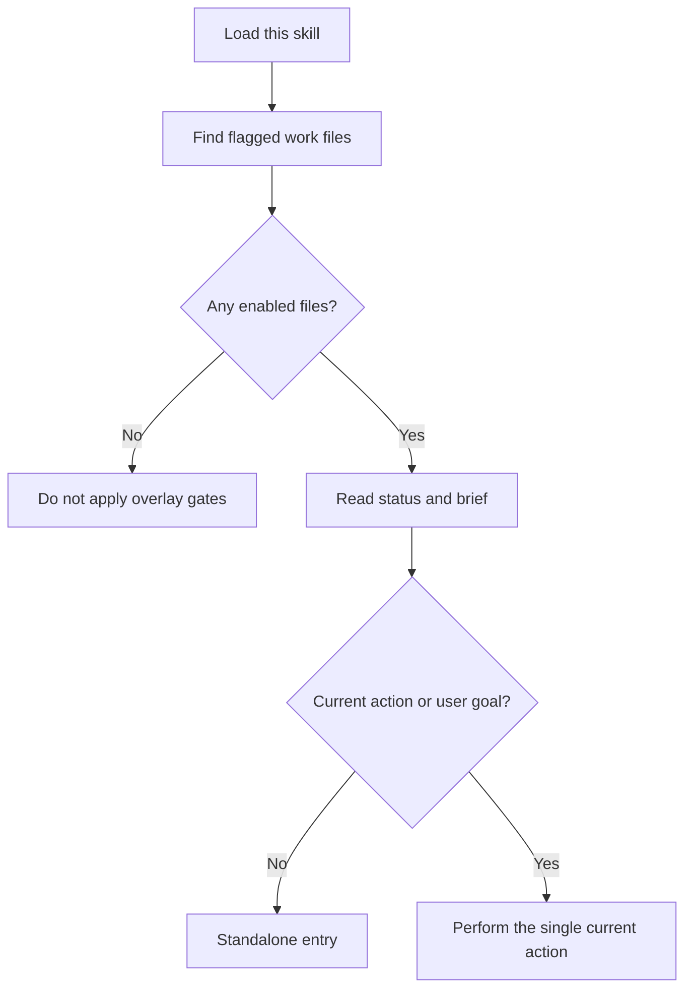

# Perk / Guild

Chat context is volatile. If the chat is the source of truth, decisions can
disappear before the work resumes. Keep the durable state in a mission's work
file.

In this skill, "mission" is a perk term, not a directory name. A mission is any
work file whose frontmatter contains `perk.guild: enabled`.

## Rehydrate first

Start here on the first load, after context compression, and in every new
conversation. Do not reconstruct state from earlier prose. Doing so can revive
closed decisions or incidental work. The file's `phase` and `current` fields
are authoritative.

1. Find work files whose frontmatter contains `perk.guild: enabled`.
2. If none exist, the overlay is inactive. Do not apply its gates until it is
   enabled.
3. Read the selected file's status and brief. Do not use a chat summary as the
   source of truth.
4. Select exactly one doctrine from `phase`. Read only that phase in
   [references/phases.md](references/phases.md).
5. If `current` is non-empty, treat the mission as instructed and continue
   only that action. Do not restore incidental work from before compression.
6. If `current`, the user's goal, and any follow-up task are all empty, use
   the standalone entry.
7. Make every status write idempotent.



Read [references/examples.md](references/examples.md) only when entering
standalone mode or resuming a mission.

## Response language and locale

Keep skill instructions and machine-readable state in English. Adapt all
user-facing prose to the user's environment:

1. Follow an explicitly requested language or locale.
2. Otherwise, use the language of the current conversation or latest user
   request.
3. If neither is clear, use the host environment's locale.
4. If no reliable signal exists, use concise English.

Localize confirmations, questions, headings, dates, and explanatory prose.
Do not translate file paths, command names, YAML keys, enum values, or code.
Do not infer the response language from the language of a work file alone.

## Standalone entry

Use this entry only when this skill is invoked without a user goal,
follow-up task, or `current` action. Starting implementation in that state
could advance the wrong parked mission.

1. Reply with a short localized confirmation equivalent to "Loaded."
2. List enabled missions whose `phase` is neither `done` nor `skip`.
   Include the file, `phase`, `current`, and `updated_at` on each line.
3. If the list is empty, say that no mission is in progress and ask whether
   to start one.
4. Otherwise, ask which mission to continue.
5. Do not implement anything before the user chooses.

When a goal, follow-up task, or `current` action exists, do not use this entry
and do not ask the user to choose. Proceed toward that instruction.

## Parent and execution procedures

An execution procedure may be active at the same time. The execution procedure
knows how to do the work; this skill knows how to close one mission. Mixing
those responsibilities creates competing definitions of success.

* Follow the execution procedure for the implementation itself.
* Keep the parent-level summary here: status, brief, transition gates,
  build-nothing outcome, evidence, the single current action, and the closing
  response.
* A child procedure must not command its parent.
* Do not accept an execution procedure's success when `evidence` is empty.
* Do not rewrite the execution procedure's completion criteria, granularity,
  audit, or verification loop.
* Refer to it generically as "the execution procedure"; do not name a
  particular procedure in this skill.

## Status

Store this YAML at the top of the work file. Preserve unknown fields and add
missing fields when needed.

```yaml
perk:
  guild: enabled
phase: research
current: ""
out_of_scope: []
evidence: []
chat_sessions: []
updated_at: ""
brief:
  pain: ""
  bounds: ""
  skip_is_success: true
target: ""
```

* `phase`: `research`, `frame`, `execute`, `inspect`, `skip`, or `done`.
* `current`: The single current action. Empty means no action is selected.
* `out_of_scope`: Work the mission will not include.
* `evidence`: Verification actually performed, including commands, results,
  or record locations. Empty evidence cannot support success.
* `chat_sessions`: Conversation references only. Do not store full chat text
  or secrets.
* `brief.pain`: Whose pain the mission addresses and what it is.
* `brief.bounds`: The limit that prevents overbuilding.
* `brief.skip_is_success`: Treat a reasoned build-nothing decision as a valid
  outcome.
* `target`: The target location. It may stay empty through research and a
  build-nothing close.

Exclude `skip` and `done` missions from the open-mission list. They may move to
the workspace's completed-work location.

Whenever a response advances the phase, update status before ending the
response so the next conversation can rehydrate.

## Brief

The brief is the entry contract. If an execution procedure defines a
requirements format, leave that format to the execution procedure.

Capture:

* whose pain is being addressed and what it is;
* the boundary that prevents overbuilding;
* that building nothing can be a successful outcome;
* an optional target.

Unrequested ideas may also be parked in this form.

## Transition gates

Treat these as entry conditions, not slogans. Do not replace an execution
procedure's quality controls; add only the missing mission-level gates.

* Do not enter `execute` until the work file records a `research` outcome.
* Do not widen scope until the file records measurable completion criteria
  and `out_of_scope`.
* Before recording progress or success, add the verification actually
  performed to `evidence`. Do not create a dedicated review file solely for
  this overlay.
* Before switching to another task, write the current mission's status.

Classify follow-up requests by intent rather than by a procedure's proper name:

* investigate demand or whether to build -> `research`
* define direction, completion criteria, or scope -> `frame`
* build, fix, or implement -> `execute`
* verify, accept, or reject -> `inspect`
* choose not to build or defer -> `skip`
* return, continue, or resume -> rehydrate

## Park and resume

* Write status before switching tasks.
* On resume, read status, brief, and `current`; do not replay raw logs or the
  mood of an old conversation.
* If a conversation identifier is available, append one `chat_sessions`
  entry with `id`, `kind`, and a short `note`. Leave it empty when no
  identifier is available.
* Treat a new conversation and post-compression continuation the same way.

## Authority direction

* The parent delegates work. A child returns proposals, results, and checks.
* Reject a response in which a child procedure commands its parent.

## Conflict resolution

The guild perk owns:

* the source of truth;
* the brief;
* phase doctrine;
* transition gates;
* build-nothing completion;
* resume behavior;
* parent-level closure.

The execution procedure owns:

* implementation steps;
* work granularity, audit, and verification loops;
* cross-mission knowledge records.

## Enable and disable

* Enabled: the work file begins with `perk.guild: enabled`. After enabling it
  for a session, persist the same field in the work file.
* Disabled: set `perk.guild: disabled`. Stop applying gates to that file and
  leave all other mission flags unchanged.
* On enable, flag the current work file. If it does not exist, create the work
  file before adding the flag.

## Guardrails

* Keep this skill, its description, examples, and conflict table free of
  project names and proper names of procedures other than perk terms and
  phase names.
* Never use chat history as the source of truth.
* Never claim unperformed verification as evidence.
* Keep exactly one current action.
* Return to `research` or `frame` when building becomes the goal by itself.
* Update status before ending any response that changes mission state.
