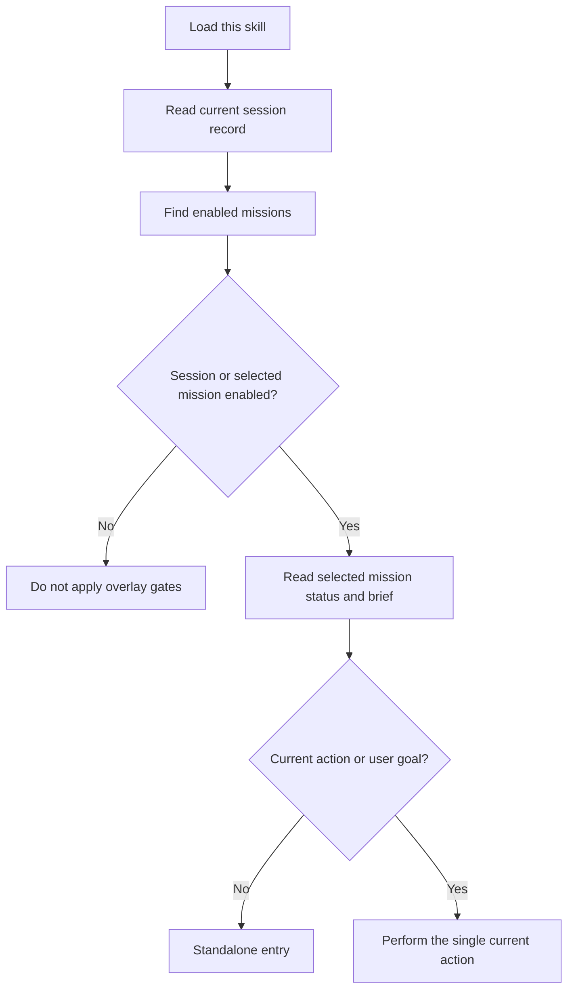

# Perk / Guild

Chat context is volatile. If the chat is the source of truth, decisions can
disappear before the work resumes. Keep the durable state in a mission's work
file.

Mission scope and conversation-session scope are independent:

* A mission is enabled when the nested YAML field path `perk.guild` resolves
  to `enabled` in its work-file frontmatter.
* A conversation session is enabled by its own record under
  `<workspace-root>/.ai-agent/perk-guild/sessions/<session-key>.yaml`.

The overlay is active when either the current conversation session or the
selected mission is enabled. A workspace-global boolean flag is intentionally
not used because it would leak state across unrelated missions and
conversations.

`perk.guild` is a nested YAML field path, not a literal key. Always write:

```yaml
perk:
  guild: enabled
```

## Rehydrate first

Start here on the first load, after context compression, and in every new
conversation. Do not reconstruct state from earlier prose. Doing so can revive
closed decisions or incidental work. The file's `phase` and `current` fields
are authoritative.

1. Resolve and canonicalize the owning workspace root, then resolve the current
   conversation's stable session identifier when the host provides one. Read
   only that session's record.
2. Resolve a mission in this order:
   explicit mission path > current work-file context > `current_mission`.
   Canonicalize an existing mission path with `realpath` before accepting it.
3. During ordinary session rehydration, clear `current_mission` when its target
   is missing, outside the owning root, disabled, `done`, or `skip`. Otherwise
   keep or update it to the canonical workspace-relative POSIX path.
4. Find other work files whose nested `perk.guild` field is `enabled`.
5. If neither the current session nor a selected mission is enabled, the
   overlay is inactive. Do not apply its gates.
6. When a mission is selected, read its status and brief. Do not use a chat
   summary as the source of truth.
7. Read and validate `active_role` after resolving session and mission state.
   Use a valid persisted role only when it matches the pending action.
   Ordinary discovery and rehydration repair stale `active_role` only in
   enabled records actually loaded; never mutate disabled or unselected
   records. Never persist or speak as `guild_master`.
8. Select exactly one doctrine from `phase`. Read only that phase in
   [references/phases.md](references/phases.md).
9. If `current` is non-empty, treat the mission as instructed and continue
   only that action. Do not restore incidental work from before compression.
10. If `current`, the user's goal, and any follow-up task are all empty, use
   the standalone entry.
11. Make every mission and session write idempotent and atomic.



Read [references/examples.md](references/examples.md) only when entering
standalone mode or resuming a mission.

## Response language and locale

Keep skill instructions and machine-readable state in English. Adapt all
user-facing prose to the user's environment:

1. Follow an explicitly requested language or locale.
2. Otherwise, use the language of the current conversation or latest user
   request.
3. If neither is clear, use the host environment's locale.
4. If no reliable signal exists, use concise English.

Localize confirmations, questions, headings, dates, and explanatory prose.
Do not translate file paths, command names, YAML keys, enum values, or code.
Do not infer the response language from the language of a work file alone.

## Guild role

Read [references/roles.md](references/roles.md) before composing any
user-visible response. Select one role from the action performed, prefix the
message with its localized label, and keep that role for the whole message.

Every assistant-authored prose message, including an error, starts with one
label on its first non-empty line. Host- or tool-rendered UI events are outside
this contract. For a locale without a documented translation, use the
canonical English label.

Persist the canonical ID as `active_role` only in the enabled record being
advanced. On handoff, write the next role before ending the message. On
rehydration, use a valid persisted role only when it matches the pending
action; otherwise derive and repair it only in enabled records actually
loaded. Never persist or speak as `guild_master`.

If role selection is genuinely ambiguous, use `submaster`, begin with its
localized label, state the handoff decision concisely, and avoid implementation
until the next role is known.

## Workspace root

Resolve `<workspace-root>` before reading or writing mission or session state:

1. Canonicalize every open workspace root with `realpath`.
2. For an existing explicit mission or current work-file context, canonicalize
   the file with `realpath` and accept it only when it is inside exactly one
   open workspace root.
3. For a new target, canonicalize its nearest existing parent with `realpath`,
   append the not-yet-created path components without resolving symlinks, and
   verify that the eventual path remains inside exactly one open workspace
   root.
4. Without a mission path or context, use the only open workspace root.
5. If these rules do not select exactly one open workspace root, stop before
   reading or writing and return a localized Submaster error.

Do not infer a root from an unrelated Git repository, sibling directory, or
process working directory. Reject path traversal and boundary-prefix lookalikes.

Before session-state access, inspect each path component from
`<workspace-root>/.ai-agent/perk-guild` through `sessions` without following
links. Reject a symlinked state directory or any symlink component in that
range. The final session-record path and `sessions/.gitignore` must remain
inside the canonical root.

Write every YAML record atomically: create a temporary file in the same
directory, write and flush the complete content, then rename or replace it over
the target. Never truncate a target in place.

Store `current_mission` as a normalized, workspace-relative POSIX path.
`current_mission` is session routing metadata: update it only when session
scope is active (`session` or `both`) or during ordinary session rehydration.
Mission-only commands never write the session record, including `active_role`
and `current_mission`. Session-only commands never create or modify mission
state.

## Standalone entry

Use this entry only when this skill is invoked without a user goal,
follow-up task, or `current` action. Starting implementation in that state
could advance the wrong parked mission.

1. Reply with a short localized confirmation equivalent to "Loaded."
2. List enabled missions whose `phase` is neither `done` nor `skip`.
   Include the file, `phase`, `current`, and `updated_at` on each line.
3. If the list is empty, say that no mission is in progress and ask whether
   to start one.
4. Otherwise, ask which mission to continue.
5. Do not implement anything before the user chooses.

When a goal, follow-up task, or `current` action exists, do not use this entry
and do not ask the user to choose. Proceed toward that instruction.

## Parent and execution procedures

An execution procedure may be active at the same time. The execution procedure
knows how to do the work; this skill knows how to close one mission. Mixing
those responsibilities creates competing definitions of success.

* Follow the execution procedure for the implementation itself.
* Keep the parent-level summary here: status, brief, transition gates,
  build-nothing outcome, evidence, the single current action, and the closing
  response.
* A child procedure must not command its parent.
* Do not accept an execution procedure's success when `evidence` is empty.
* Do not rewrite the execution procedure's completion criteria, granularity,
  audit, or verification loop.
* Refer to it generically as "the execution procedure"; do not name a
  particular procedure in this skill.

## Status

Store this YAML at the top of the work file. Preserve unknown fields and add
missing fields when needed.

`perk.guild` is a nested YAML field path, not a literal key.

```yaml
perk:
  guild: enabled
active_role: submaster
phase: research
current: ""
out_of_scope: []
evidence: []
chat_sessions: []
updated_at: ""
brief:
  pain: ""
  bounds: ""
  skip_is_success: true
target: ""
```

* `active_role`: The canonical current or next agent role (`submaster`,
  `strategist`, `quest_leader`, or `quest_runner`). Must never be
  `guild_master`. On rehydration, use a valid persisted role only when it
  matches the pending action; otherwise derive and repair it from the pending
  action.
* `phase`: `research`, `frame`, `execute`, `inspect`, `skip`, or `done`.
* `current`: The single current action. Empty means no action is selected.
* `out_of_scope`: Work the mission will not include.
* `evidence`: Verification actually performed, including commands, results,
  or record locations. Empty evidence cannot support success.
* `chat_sessions`: Privacy-preserving persisted-session references only. Start
  as an empty list (`chat_sessions: []`). Append an entry only when the current
  session record was persisted. Upsert by `session_alias`: update an existing
  alias entry and never duplicate. Store `session_alias`, `kind`, and a short
  `note`. Never write `session_key`, a raw host identifier (`raw_host_id`), the
  session-record filename/key, full chat text, or secrets.
* `brief.pain`: Whose pain the mission addresses and what it is.
* `brief.bounds`: The limit that prevents overbuilding.
* `brief.skip_is_success`: Treat a reasoned build-nothing decision as a valid
  outcome.
* `target`: The target location. It may stay empty through research and a
  build-nothing close.

Exclude `skip` and `done` missions from the open-mission list. They may move to
the workspace's completed-work location.

Whenever a response advances the phase, update status before ending the
response so the next conversation can rehydrate.

## Conversation-session record

Store session state separately from mission state:

```text
<workspace-root>/.ai-agent/perk-guild/sessions/<session-key>.yaml
```

Use a stable conversation identifier supplied by the host. Encode the
identifier as UTF-8 and compute its SHA-256 digest. The `session-key` is the
full 64-character lowercase hexadecimal digest. Hash every identifier,
including identifiers that already contain only filename-safe characters.
Never persist the raw conversation identifier.

```yaml
perk:
  guild: enabled
active_role: submaster
session_key: "<sha256-lowercase-hex>"
session_alias: "<uuid-v4>"
current_mission: ""
updated_at: ""
```

* `session_key`: The SHA-256 lowercase hexadecimal key used in the filename.
* `session_alias`: A random UUIDv4 created once for a new record. Reuse its
  `session_alias` on every update to that record; never rotate it. This is the
  only session identifier allowed in mission `chat_sessions`.
* `active_role`: The canonical current or next agent role for this
  conversation (`submaster`, `strategist`, `quest_leader`, or `quest_runner`).
  Must never be `guild_master`. On rehydration, use a valid persisted role only
  when it matches the pending action; otherwise derive and repair it from the
  pending action.
* `current_mission`: An optional normalized, workspace-relative POSIX path
  used by this conversation.
* `updated_at`: The most recent idempotent update.

Session routing state is workspace-local and must stay out of version control.
Whenever session persistence is enabled, idempotently ensure this file exists:

```text
<workspace-root>/.ai-agent/perk-guild/sessions/.gitignore
```

with exactly these ignore rules, preserving an already-correct file:

```gitignore
*
!.gitignore
```

When the host does not expose a stable conversation identifier, keep
session-scoped enablement only in the current conversation context. Do not
write a file and do not use a workspace-global fallback. Mission-scoped state
continues to work normally. This in-memory state is lost after context
compression, closing the conversation, or restarting the host; report
`session_persisted: false`. Report mission persistence independently as
`mission_persisted`.

Session records are routing state, not mission truth. Keep the brief, phase,
current action, and evidence in the mission work file.

An absent session record means session scope is disabled. Enabling creates or
updates only the current session's record; disabling removes only that record.
Do not expire enabled records automatically because reopening the same
conversation must restore its scope.

Resolve a session's mission in this order:

```text
explicit mission path > current work-file context > `current_mission`
```

When session scope is active and the conversation selects or switches
missions, update `current_mission`. Ordinary session rehydration clears
`current_mission` when the referenced file is missing, outside the owning
workspace root, disabled, `done`, or `skip`. If a mission is moved, update the
path only after resolving the new location from explicit or current work-file
context; never guess. A mission-only enable or disable leaves
`current_mission` unchanged.

## Brief

The brief is the entry contract. If an execution procedure defines a
requirements format, leave that format to the execution procedure.

Capture:

* whose pain is being addressed and what it is;
* the boundary that prevents overbuilding;
* that building nothing can be a successful outcome;
* an optional target.

Unrequested ideas may also be parked in this form.

## Transition gates

Treat these as entry conditions, not slogans. Do not replace an execution
procedure's quality controls; add only the missing mission-level gates.

* Do not enter `execute` until the work file records a `research` outcome.
* Do not widen scope until the file records measurable completion criteria
  and `out_of_scope`.
* Before recording progress or success, add the verification actually
  performed to `evidence`. Do not create a dedicated review file solely for
  this overlay.
* Before switching to another task, write the current mission's status.

Classify follow-up requests by intent rather than by a procedure's proper name:

* investigate demand or whether to build -> `research`
* define direction, completion criteria, or scope -> `frame`
* build, fix, or implement -> `execute`
* verify, accept, or reject -> `inspect`
* choose not to build or defer -> `skip`
* return, continue, or resume -> rehydrate

## Park and resume

* Write status before switching tasks.
* On resume, read status, brief, and `current`; do not replay raw logs or the
  mood of an old conversation.
* If the current session record was persisted, read only that record and upsert
  one mission `chat_sessions` entry by its reused `session_alias`, `kind`, and a
  short `note`. Never duplicate an existing alias.
* If session state is not persisted, do not append a mission chat-session
  reference. Also leave the mission index unchanged when the current session
  record cannot be loaded.
* Treat a new conversation and post-compression continuation the same way.

## Authority direction

Authority flows from Guild Master to Submaster to Quest Leader to Quest
Runner. The Strategist returns approval or rejection with an alternative
course to the Submaster and does not order the Quest Runner directly.

* The Submaster delegates work to the Quest Leader. The Quest Leader hands off
  to the Quest Runner. The Quest Runner returns proposals, results, and checks.
* Reject a response in which the Quest Runner or an execution procedure
  commands the Submaster.

## Conflict resolution

The guild perk owns:

* the source of truth;
* the brief;
* phase doctrine;
* transition gates;
* build-nothing completion;
* resume behavior;
* parent-level closure.

The execution procedure owns:

* implementation steps;
* work granularity, audit, and verification loops;
* cross-mission knowledge records.

## Enable and disable

Support three explicit scopes: `session`, `mission`, and `both`. The default is
`both`.

* Session enablement changes only the current conversation's session record,
  or in-memory state when no stable session identifier exists.
* Mission enablement changes only the selected work file. Follow the
  authoritative mission creation decision table in the enable prompt. An explicit
  missing path is always an error. Create a mission only from an explicit
  existing path, current work-file context, or a non-empty goal with a
  deterministic derived name.
* Session disablement removes only the current session record and must not
  alter a mission.
* Mission disablement must not alter another mission or session.
* `both` applies the corresponding operation independently to the current
  session and selected mission.
* Effective state is the union of both scopes: the overlay remains active when
  either the current session or selected mission is enabled.
* After every enable or disable operation, keep `session`, `mission`, and
  `effective` separate and report the booleans `session_persisted` and
  `mission_persisted`.
* With `both`, no selected mission, and no goal, apply only session scope and
  report mission scope as `skipped`. Do not create a timestamp-named mission.
* Derive goal-based names deterministically and reuse an existing matching work
  file.
* Mission-only commands never write the session record, including `active_role` and `current_mission`.
* Session-only commands never create or modify mission state.
* Disable does not persist a replacement `active_role`; it reports as
  Submaster without writing that role into a deleted session record or
  disabled mission.

## Legacy workspace flag

Moving from 0.1.x to 0.2.0 is a breaking migration, not an automatic migration.
The former workspace-global `.ai-agent/perk-guild.yaml` file is ignored and
left untouched. It is not authoritative for either scope.

After upgrading, run `/perk-guild-enable --scope session`,
`/perk-guild-enable --scope mission`, or
`/perk-guild-enable --scope both` to establish the intended 0.2.0 state. Verify
the new state, then delete the legacy file when satisfied.

## Guardrails

* Keep this skill, its description, examples, and conflict table free of
  project names and proper names of procedures other than perk terms and
  phase names.
* Never use chat history as the source of truth.
* Never claim unperformed verification as evidence.
* Keep exactly one current action.
* Return to `research` or `frame` when building becomes the goal by itself.
* Update status before ending any response that changes mission state.
* Never replace a missing session identifier with a workspace-global flag.
