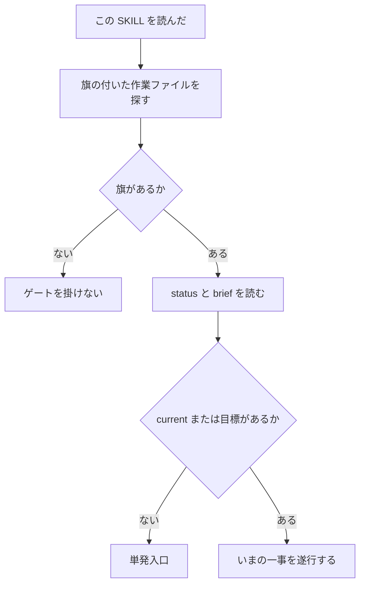

# Perk / Guild

チャットは揮発する。夕方に戻ったとき、正本がチャットだと判断が消える。
状況の正本はミッションのファイルに置く。

ミッションは perk の語であり、ディレクトリ名ではない。
実体は、先頭に `perk.guild: enabled` がある作業ファイルである。

## 再水和

初回も、圧縮後の再読込も、新しい窓も、この節から始める。前文を読んでから始めない。
圧縮後は前文を信じると、閉じた判断やついで仕事が復活する。残っているのはファイルの `phase` と `current` である。

1. 作業ファイルを探す。先頭に `perk.guild: enabled` がある文書が対象である
2. 旗が一つも無い → overlay は効いていない。有効化されるまで、この SKILL のゲートは掛けない
3. いま扱うファイルの status と brief をファイルから読む。チャットの要約は正本にしない
4. `phase` で教義を一つ選ぶ。会話の空気で局面を推測しない。選んだ局面だけ [references/phases.md](references/phases.md) を読む
5. `current` がある → 指示あり。その一事だけ続ける。圧縮前の「ついで」は引き継がない
6. `current` が無く、ユーザー目標も後続作業も無い → 単発。入口の節へ行く
7. 書き込みは冪等にする。同じ status を二度書いても壊れない



単発と再開の応答の型は、入口または再開のときだけ [references/examples.md](references/examples.md) を読む。

## 単発入口

この SKILL だけが呼ばれ、目標も後続作業も `current` も無いとき。
無指示で実装に入ると、駐車した別件を勝手に進める。選ばせるのが親の仕事である。

1. 「読み込みました。」と返す
2. 旗が付き、`phase` が `done` でも `skip` でもないミッションを一覧する
   * 各行: ファイル、`phase`、`current`、`updated_at`
3. 0件なら、進行中は無いと書き、新しく始めるか聞く
4. 1件以上なら、「どの作業をしますか」と聞く
5. 聞かれる前に実装へ進まない

目標、後続作業、または `current` があるときは、この入口を使わない。聞かない。その目標の解決に向けて、この SKILL どおりに遂行する。

## 親と実行

追加で実行側の手続きが載ってもよい。
実行側は作り方を知っている。親は一件の状況を閉じる。混ぜると、success の定義が二重になる。

* 実行の中身は、実行側の手続きに従う
* 親の総括はこの SKILL が持つ。status、brief、遷移ゲート、作らない完了、証拠欄、いまやる一事、応答の締め
* 下位は上位を命令しない
* 実行側が success と書いても、証拠欄が空なら親は成功にしない
* 実行側の完了条件（粒度、監査、検証の回し方）は親が書き換えない
* 実行側の手続きを名前で呼ばない

## status

作業ファイル先頭の YAML に置く。欄を足して壊さない。無い欄は足してよい。

```yaml
perk:
  guild: enabled
phase: research
current: ""
out_of_scope: []
evidence: []
chat_sessions: []
updated_at: ""
brief:
  pain: ""
  bounds: ""
  skip_is_success: true
target: ""
```

* `phase`: `research` / `frame` / `execute` / `inspect` / `skip` / `done`
* `current`: いまの作業ひとつ。空なら一事は未選択
* `out_of_scope`: やらないこと
* `evidence`: 実行した検証。コマンド、結果、記録の場所。空の success は禁止
* `chat_sessions`: 会話の索引。本文や秘密は書かない
* `brief.pain`: 誰の、何の痛みか
* `brief.bounds`: やりすぎない範囲
* `brief.skip_is_success`: 作らない判断も成果である
* `target`: 対象の置き場。空のまま調査して閉じてよい

閉じたミッション（`skip` / `done`）は進行中一覧から外す。完了置き場へ移してよい。

局面を進めたら、その応答の終わりに status を更新する。圧縮の次ターンで戻れるようにするためである。

## brief

入口の契約である。作業本文の要件書式は、実行側があればそちらに任せる。

揃えるもの:

* 誰の、何の痛みか
* やりすぎない範囲
* 作らない判断も成果とする
* 対象は未定でよい

無指示の着想も、この型で置ける。

## 遷移ゲート

進む前に通る。一文の禁止ではなく、通過条件である。
実行側の品質手続きは置き換えない。足りない通過条件だけを足す。

* `research` の成果がファイルに無い状態で `execute` へ進まない
* `frame`（完了条件と `out_of_scope`）がファイルに無い状態で範囲を増やさない
* `progress` / `success` を書くとき、`evidence` に実行した検証を残す。検証の記録なら何でもよい。専用の点検ファイルは作らない
* 別件へ移る前に status が書いてある。書いていなければ移らない

後続の依頼は種類で見る。固有の手続き名では分岐しない。

* 調べる、需要、作るべきか → `research`
* 方針、完了条件、範囲 → `frame`
* 作る、直す、実装 → `execute`
* 確認、成功、失敗 → `inspect`
* 作らない、見送る → `skip`
* 戻る、続ける、再開 → 再水和

## 停車と再開

* 別件の前に status を書く
* 再開は status と brief と `current` だけ読む。生ログと古い会話の空気は読まない
* 会話の識別子が取れるなら `chat_sessions` に 1 件足す。`id` と `kind` と短い `note`。取れなければ空でよい
* 新しい窓も圧縮後も、再水和と同じ

## 権限の向き

* 親が作業を渡す。下位は提案、結果、点検を返す
* 下位が上位を命令する応答は無効である

## 衝突

guild perk が勝つもの:

* 状況の正本
* brief
* 局面の教義
* 遷移ゲート
* 作らない完了
* 再開
* 親の総括

実行側が勝つもの:

* どう実装するかの手順
* 粒度、監査、検証の回し方
* 横断の知見メモ（一件の status とは別）

## 有効と無効

* 有効: 作業ファイル先頭が `perk.guild: enabled`。Session で有効化したあとも、同じ欄をファイルに残す
* 無効: `perk.guild: disabled`。以降このファイルではゲートを掛けない。他ファイルの旗は触らない
* 有効化と同時に、いまの作業ファイルへ旗を押す。ファイルがまだ無いなら、作業ファイルを起こしてから旗を押す

## ガードレール

* この本文、description、例、衝突表に、特定のプロジェクト名と、perk 以外の手続きの固有名を書かない。書いてよいのは perk 自身の語と局面の種類だけである
* チャット履歴を正本にしない
* 未実行の検証を成功と書かない
* いまやることは一つに限る
* 作ることが目的化したら `research` または `frame` へ戻る
* 応答の終わりに status を更新する
